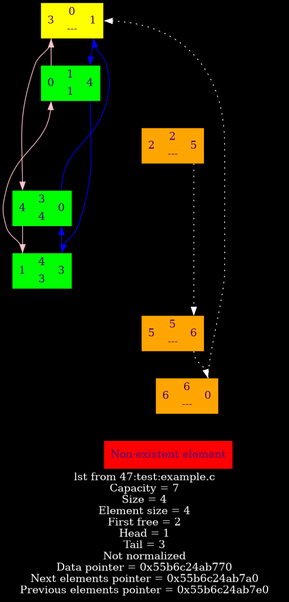

# Doubly linked list

This is a fast implementation of doubly linked list.

## Debugging

This list has its dump function to the `.dot` format which
will be converted to `.png` picture by GraphViz library.

List has silent validation. To disable it define `NDEBUG` macro
before including header `list.h`.

## Exxample

There is an example of usage **[here](example/ "Example folder")**.

An implementation uses virtual element which is painted in yellow
that's why the capacity on dump is greater by one than the capacity which user chose.

# Good luck!!!
